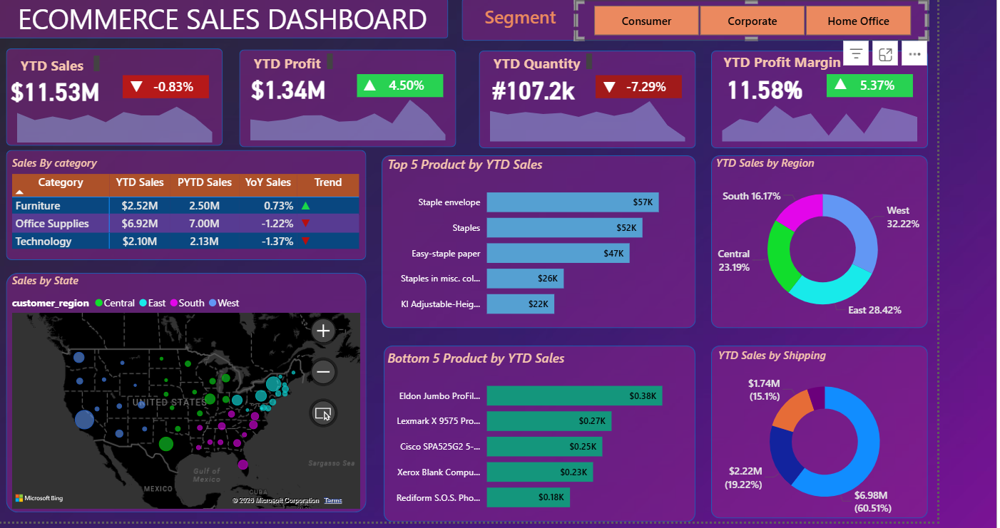

# 🛒 E-Commerce Sales Analysis Dashboard

## 📌 Project Overview

This Power BI dashboard provides a comprehensive analysis of e-commerce sales performance, profitability, customer segments, regional trends, and product-level insights. The dashboard is designed to help stakeholders monitor KPIs, identify growth opportunities, and make data-driven business decisions.

---

## 🛠 Tools & Technologies

- Power BI
- Power Query
- DAX
- Data Modeling
- Data Visualization
- Excel

---

## 📊 Dashboard Preview

---

## 🎯 Key Performance Indicators (KPIs)

- YTD Sales: $11.53M
- YTD Profit: $1.34M
- YTD Quantity: 107.2K
- Profit Margin: 11.58%

---

## 📈 Business Insights

- Consumer segment generated the highest sales contribution.
- West region contributed the largest share of total revenue.
- Office Supplies category achieved the highest overall sales.
- Top 5 and Bottom 5 products were identified for performance tracking.
- Shipping mode analysis highlighted revenue contribution across delivery methods.
- Regional analysis helped identify high-performing markets.

---

## 📂 Project Features

- Sales Analysis by Category
- Regional Performance Tracking
- Customer Segment Analysis
- Profitability Analysis
- Top & Bottom Product Performance
- Shipping Mode Comparison
- Interactive Dashboard Filters

---

## 🚀 Skills Demonstrated

- Data Cleaning
- Data Transformation
- Data Modeling
- DAX Calculations
- KPI Design
- Dashboard Development
- Business Intelligence Reporting

---

## 📁 Repository Contents

- Power BI Dashboard (.pbix)
- Dashboard Screenshot
- Project Documentation

---

## 👨‍💻 Author

**Arpan Jain**

Aspiring Data Analyst | Power BI Developer | Business Intelligence Enthusiast
